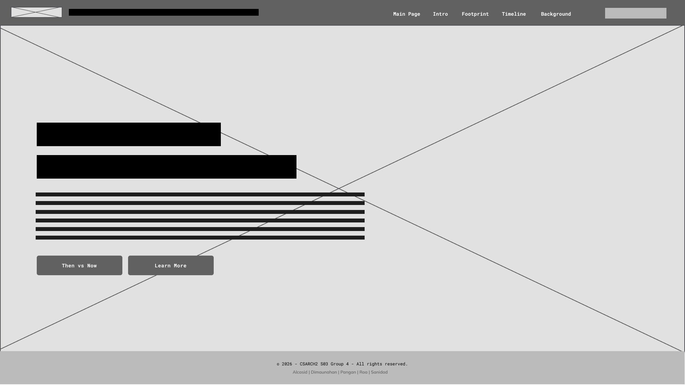
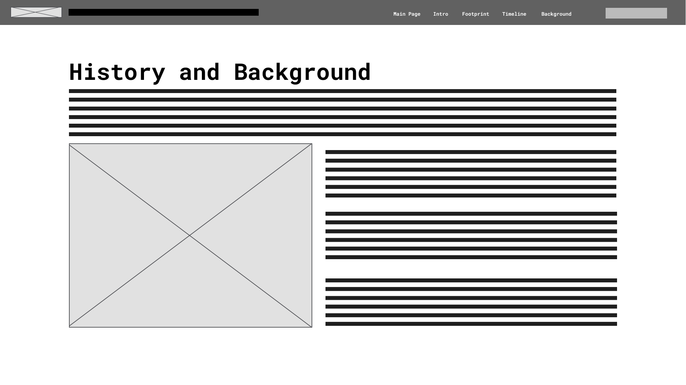
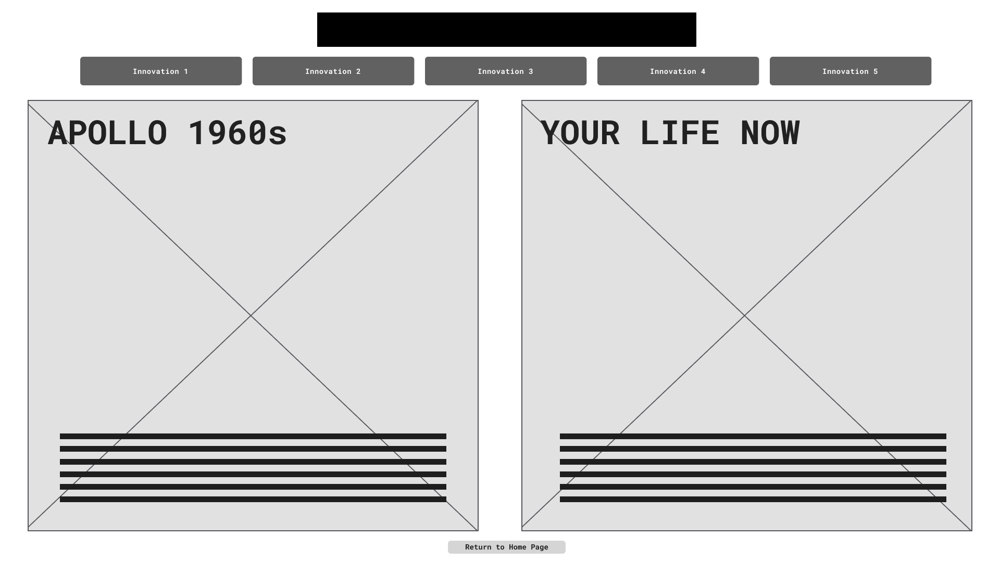
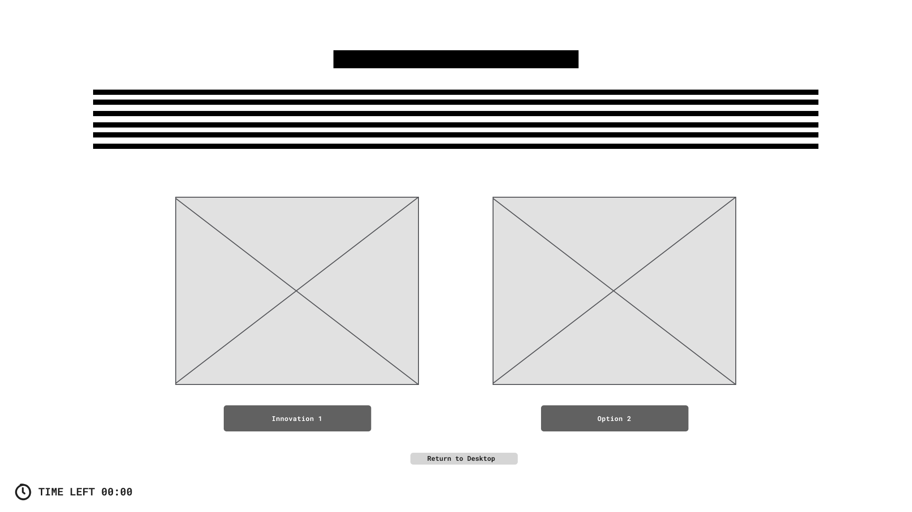
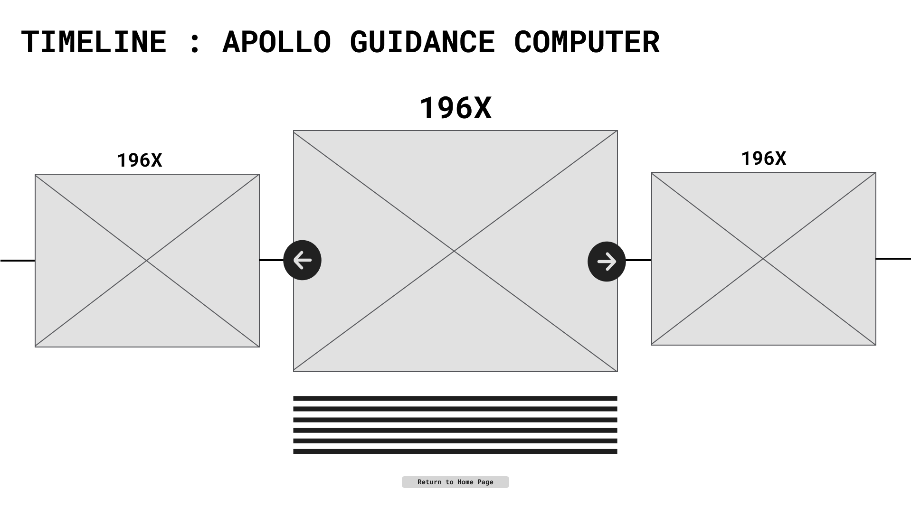
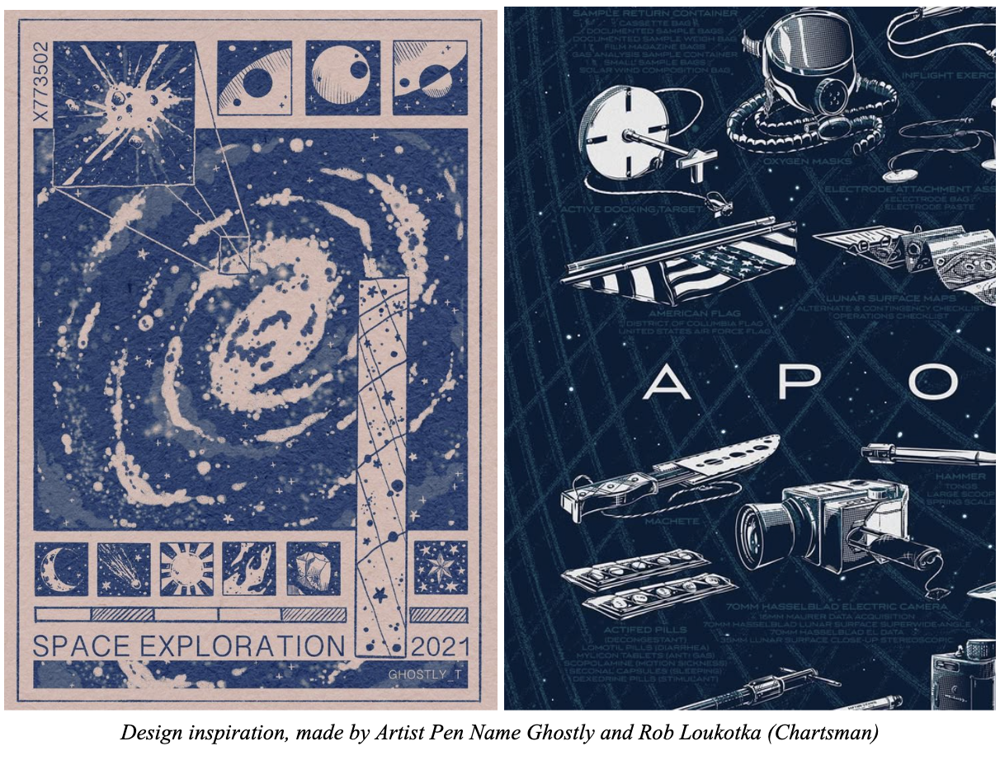

# INCREMENTAL README -- Changelog

## July 6, 2026
### Changes:
* Added homepage with hyperlinks to interactive elemets: Then vs Now, Timeline, Workshop

## July 7, 2026
### Changes:
* Debated whether to keep the interactive elements in the homepage or link them to a different page
* Added interactive timeline and interactive workshop (Still a WIP)
* Interactive workshop is integrated into the homepage instead of having its own hyperlink
* Cleaned up introduction layout

---

# Inside the Apollo Guidance Computer: The Technology That Took Us to the Moon

## Project Information

**Course:** CSARCH2

**Section & Theme:** S03 – Problem-Solving Stories

**Topic:** Apollo Guidance Computer (AGC)

### Group 4

* ALCASID, Aizy Danielle
* DIMAUNAHAN, Chelsea Jei
* PANGAN, Aaliyah Maxine Rochelle
* ROA, Luis Antonio
* SANIDAD, Christian Gabriel

---

# Introduction

The Apollo Guidance Computer (AGC) was developed by the MIT Instrumentation Laboratory between 1961 and 1972. The AGC was one of the first computers to rely on integrated circuits, which allowed it to meet the strict size, weight, and power restrictions required for the Apollo missions while maintaining the reliability needed for mission operations.

This push for miniaturization and dependability set new standards for digital computing. The innovations born from the AGC did not stay on the Moon. Many of the technologies and design principles pioneered by the AGC later influenced modern smartphones, aircraft systems, and medical devices.

---

# Proposed Interactive Elements

## Then & Now Narrative

This interactive split-screen experience allows visitors to explore how innovations from the Apollo Guidance Computer evolved into technologies used today.

The left side highlights a specific innovation from the Apollo era, while the right side shows how that same innovation is applied in modern technology. Users can select from five different innovations, and each selection updates both sides simultaneously to reveal a "then and now" comparison.

This design helps visitors understand the direct connection between Apollo-era engineering and the technology they use every day.

## Interactive Timeline of Events

The exhibit also features an interactive timeline showing the development of the Apollo Guidance Computer alongside major events during the Space Race.

Visitors can click on different timeline points to explore historical details, including:

* The 1961 transition toward integrated circuits
* Hardware development and testing phases
* The Apollo 11 landing
* The famous AGC overload alarms during the lunar descent

The timeline helps visitors understand how technical challenges emerged and how engineers solved them throughout the project.

---

# Exhibit Details

## All About the AGC

Developed by the MIT Instrumentation Laboratory, the Apollo Guidance Computer was one of the first computers built with integrated circuits and used core memory as well as read-only magnetic rope memory. Compared to older computers, which often occupied entire rooms, the AGC was compact enough to fit inside a spacecraft.

NASA wanted astronauts to perform calculations in real time during flight instead of relying entirely on ground-based analog computers, which were not fast or reliable enough for a mission to the Moon.

The AGC introduced several architectural features that were uncommon at the time. It used erasable core memory for changing mission data and magnetic rope memory for permanently storing software. By separating mission data from mission software, the system became more reliable because critical programs could not be modified during flight.

Magnetic rope memory also allowed a large amount of software to be stored in a compact space, which was important due to the spacecraft's strict weight limitations.

The AGC also featured the DSKY (Display and Keyboard), which allowed astronauts to communicate directly with the computer. Through the DSKY, astronauts could monitor spacecraft information and perform navigation tasks in real time.

Another important architectural feature was the AGC's interrupt-driven design and priority scheduling system. This allowed the computer to handle multiple tasks simultaneously while prioritizing critical navigation and guidance calculations. As a result, the AGC could continue operating even when the system became overloaded.

The AGC did not only solve NASA's problems related to the Moon mission. It also addressed limitations of earlier computers through its use of integrated circuits, making it significantly smaller than previous vacuum tube- and transistor-based systems. The AGC helped accelerate the adoption of integrated circuits throughout the computer industry, paving the way for smaller, more reliable, and more portable electronic devices.

---

# Design and Layout

## Home Page

The home page serves as the entry point of the exhibit. It contains the exhibit title, introductory information about the Apollo Guidance Computer, and navigation links to different sections of the website. Visitors are provided with a brief overview of the topic and can proceed to explore the historical content or begin the interactive experience.

## History, Background, and Notable Figures

This section provides an overview of the Apollo Guidance Computer and the technological challenges that contributed to its development.

Visitors are also introduced to notable individuals and organizations that played significant roles in the creation of the AGC's hardware and software.

## AGC Innovations Footprint

This section highlights innovations from the Apollo Guidance Computer that are still present in modern technology.

The layout is divided into two panels:

* Apollo-era innovation
* Modern-day application

Users can select different innovations to compare their historical origins with their present-day uses.

## Interactive Minigame

To make the exhibit more interactive, visitors will participate in a choice-based mini-game where they take on the role of an engineer helping build the Apollo Guidance Computer. Users must identify which AGC innovations solved the limitations of older computers, such as integrated circuits, magnetic rope memory, the DSKY, and priority scheduling. Each correct answer adds a new component to the AGC, gradually assembling the computer while teaching visitors about its architectural improvements.

## Interactive Timeline

The timeline presents the history of the Apollo Guidance Computer through a horizontally scrollable interface.

As visitors move through the timeline, the selected event expands and becomes the focal point. Additional information, images, and historical context appear below the selected event.

---

# Style Guide

## Color Palette

| Element       | Choice            |
| ------------- | ----------------- |
| Primary Color | Off White / Beige |
| Background    | Deep Navy         |
| Accent Color  | Gold / Dusty Blue |

## Typography

| Usage             | Font          |
| ----------------- | ------------- |
| Heading Font      | Space Grotesk |
| Body Font         | Inter         |
| Retro/System Font | IBM Plex Mono |

---

# Design Inspiration

The exhibit adopts a halftone retro aesthetic with deep navy grids and dotted shading inspired by vintage print textures and space-age technical manuals.

Typography is intentionally blocky and system-oriented to evoke the feel of early computing systems and historical aerospace documentation.

### Inspiration Images

---

# References

* 1968 | Timeline of Computer History | Computer History Museum. (n.d.). https://www.computerhistory.org/timeline/1968/#169ebbe2ad45559efbc6eb357204a28c 

* Atkinson, N. (2025, June 13). The story of the Apollo Guidance Computer, Part 2. Universe Today. https://www.universetoday.com/articles/the-story-of-the-apollo-guidance-computer-part-2 

* Mattioli, M. (2021). The Apollo Guidance computer. IEEE Micro, 41(6), 179–182. https://doi.org/10.1109/mm.2021.3121103 

* Sotomayor, B. (2016, July 9). A Glimpse into the Apollo Guidance Computer. Medium. https://borja.medium.com/a-glimpse-into-the-apollo-guidance-computer-8ee06e5e1a5c 

